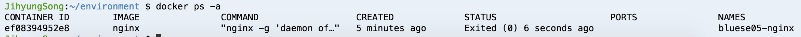
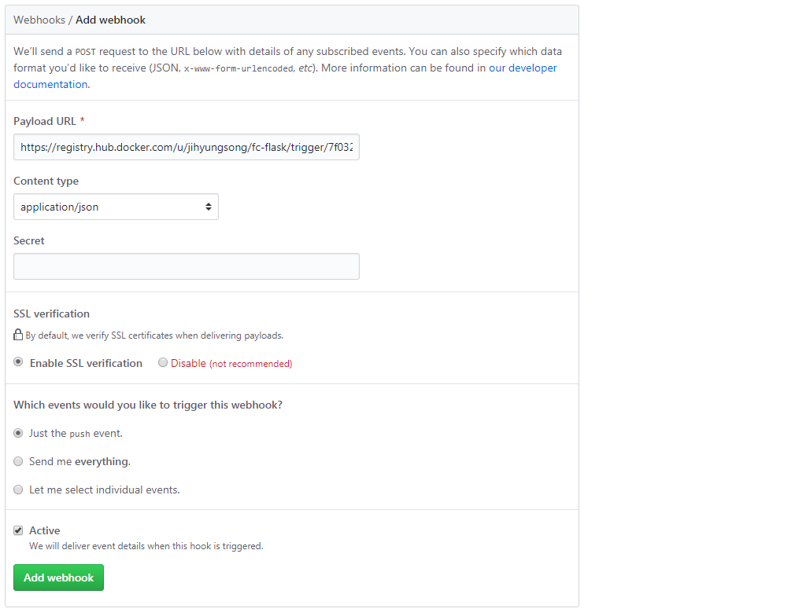

Docker를 활용한 구성 실습
=============

# 목차
* [1. Docker 설치 및 구성](#1-docker-설치-및-구성)
  * [1.1. Cloud9 접속하기](#11-cloud9-접속하기)
* [2. Docker 동작 실습](#2-docker-동작-실습)
  * [2.1. Container 구동](#21-container-구동)
  * [2.2. Container 중지](#22-container-중지)
  * [2.3. Container 삭제](#23-container-삭제)
* [3. Docker 이미지 빌드](#3-docker-이미지-빌드)
  * [3.1. Sample 내려받기](#31-sample-내려받기)
  * [3.2. Dockerfile로 이미지 빌드](#32-dockerfile로-이미지-빌드)
  * [3.3. Dockerfile로 빌드된 이미지로 Container 배포](#33-dockerfile로-빌드된-이미지로-container-배포)
* [4. Docker Hub로 이미지 Push](#4-docker-hub로-이미지-push)
  * [4.1. Docker login](#41-docker-login)
  * [4.2. Docker Hub로 이미지 Push](#42-docker-hub로-이미지-push)
* [5.1. Git에서 바로 이미지 Build](#51-git에서-바로-이미지-build)
* [5.2. Github에 Push하는 즉시 Docker Hub에 이미지 Build 해보기](#52-github에-push하는-즉시-docker-hub에-이미지-build-해보기)
* [5.3. Gitlab과 Jenkins를 통한 CI 구축](#53-gitlab과-jenkins를-통한-ci-구축)

# 1. Docker 설치 및 구성
## 1.1 Cloud9 접속하기
Docker 실습은 각자의 Cloud9 환경에서 실행할 예정이다.  
Cloud9에는 이미 Docker(현재 18.03.1-ce 버전) 가 설치되어 있기 때문에 별도의 설치 과정 없이 바로 사용 가능하다.

```bash
JihyungSong:~/environment $ docker --version
Docker version 18.03.1-ce, build 3dfb8343b139d6342acfd9975d7f1068b5b1c3d3
```

# 2. Docker 동작 실습
## 2.1. Container 구동
Cloud9 환경에 container를 하나 구동시켜보자. 예제로 nginx 웹서버 하나를 띄워볼 것이다.   
먼저 nginx 이미지를 찾아보자.

```bash
JihyungSong:~/environment $ docker search nginx
```


Search 명령으로 docker registry에서 image 정보를 검색 가능하다. 이 중 가장 첫번째 nginx 이미지를 배포해 보자. 

```bash
JihyungSong:~/environment $ docker run --name bluese05-nginx -d -p 80:80 nginx 
609d45ac0a23747c2858857b60f5c8343fc99ad1a64554071d9917350aa2ff80
```


docker run 을 수행 하게 되면,   
docker hub 라는 public repository 에서 부터 로컬 환경으로 해당 이미지를 다운 받는 절차를 거친 후 Container를 구동시키게 된다.  
Container 구동이 완료되면 위와 같이 프롬프트가 돌아온다.  
Container가 잘 구동 되었는지 확인해 보자.   

```bash
JihyungSong:~/environment $ docker ps

```


Localhost로 curl을 통해 웹서버가 응답하는지 확인해 보자.

```bash
JihyungSong:~/environment $ curl http://localhost 
```


## 2.2. Container 중지
이제 실행중인 container를 중지 시켜보자

```bash
JihyungSong:~/environment $ docker stop bluese05-nginx
bluese05-nginx
```



Container의 status가 Exited 상태임을 볼 수 있다. 

## 2.3. Container 삭제
이제 중지된 container를 삭제해보자 

```bash
JihyungSong:~/environment $ docker rm bluese05-nginx
bluese05-nginx
```

# 3. Docker 이미지 빌드
Dockerfile 을 이용하면, 내가 구성하고 싶은 서버의 Container 이미지를 손쉽게 빌드가 가능하다.  
이번 실습에서는 Flask로 Python Web Application 서버를  
Dockerfile을 이용해 이미지화 하여 Container로 배포하는 실습을 해보도록 한다.   

## 3.1 Sample 내려받기
먼저 Dockerfile 샘플을 gitlab 에서 내려받도록 한다.

```bash
JihyungSong:~/environment $ git clone http://18.136.34.219/devops/sample.git sample 
Cloning into 'sample'...
remote: Counting objects: 889, done.
remote: Compressing objects: 100% (25/25), done.
remote: Total 889 (delta 30), reused 38 (delta 24)
Receiving objects: 100% (889/889), 508.89 KiB | 16.42 MiB/s, done.
Resolving deltas: 100% (437/437), done.
```

sample/docker 디렉토리로 이동하면 아래와 같이 Dockerfile 과 config 파일 및 source 디렉토리를 확인할 수 있다.

```bash
JihyungSong:~/environment $ cd sample/docker/
JihyungSong:~/environment/sample/docker (master) $ ls
Dockerfile  flask.conf  img  source  training.md
```

## 3.2. Dockerfile로 이미지 빌드

Dockefile을 이용해 이미지를 빌드해 보자. 실행은 Dockerfile이 있는 디렉토리에서 수행하도록 한다.
이때 Image 이름 자체가 repository 경로를 의미한다. <계정명>/image명:TAG 로 구성된다.

```bash
JihyungSong:~/environment $ docker build -t jihyungsong/flask:0.1 . 
```


Dockerfile에 정의된 내용에 따라 이미지를 생성하기 시작한다.  
시간이 꽤 소요되는 작업이며, 완료되면 아래와 같이 Successfully built 라는 메시지와 함께 이미지 ID를 반환한다. 


내가 만든 이미지가 잘 생성되었는지 확인해 본다.  
Docker images 라는 명령을 통해 현재 local에 빌드가 완료된 이미지를 확인 가능하다.

```bash
JihyungSong:~/environment $ docker images 
JihyungSong:~/environment/sample/docker (master) $ docker images
REPOSITORY          TAG                 IMAGE ID            CREATED             SIZE
"jihyungsong/flask      0.1                 ace7ec01e7cb        5 seconds ago       468MB"
ubuntu              16.04               52b10959e8aa        2 days ago          115MB
nginx               latest              c82521676580        4 weeks ago         109MB
```

## 3.3. Dockerfile로 빌드된 이미지로 Container 배포

이미지가 잘 생성되었다면, 이를 이용해 Container를 구동 시켜보자. 

```bash
JihyungSong:~/environment $ docker run --name jihyungsong-flask -d -p 5000:5000 jihyungsong/flask:0.1  
b2795caa8d9c9fa09e0e28f1d53090b1c3b4f619c1829fe523bc69ab29f29357
```

Container를 실행하면, 위와 같이 Container UUID를 반환한다. 실행시킨 Container가 잘 떠 있는지 확인해 보자. 

```bash
JihyungSong:~/environment $ docker ps -a  
```


실제 실행이 잘 되는지 확인해 보자.

```bash
JihyungSong:~/environment $ curl http://localhost:5000 
```

웹브라우저에서 확인하고 싶으면, 아래와 같은 추가적인 작업이 필요하다.
* 자신의 Cloud9 환경이 동작되고 있는 EC2 instance 를 찾음.
* 해당 instance 에 적용된 Security Group을 찾아 inbound TCP 5000 포트를 오픈.


# 4. Docker Hub로 이미지 Push

위에서 빌드한 이미지는 Docker host로 동작중인 Cloud9의 EC2에 저장되어 있다. 이것을 Docker Hub로 Push 해보자.  
Docker Hub는 Docker 진영에서 공식적으로 운영중인 Public 저장소이다.  
**Docker Hub** : https://hub.docker.com/ 

Docker Hub에 가입하면 Public repository 는 자유롭게 사용가능하며, Private의 경우는 유료로 사용 가능하다.  

## 4.1. Docker login

Docker Hub에 가입하였다면, 나의 Docker 환경에서 Docker Hub를 사용하기 위해 먼저 Login 절차를 수행한다.
Docker Hub에 가입시 입력한 username과 password로 로그인한다.

```bash
JihyungSong:~/environment/sample/docker (master) $ docker login
Login with your Docker ID to push and pull images from Docker Hub. If you don't have a Docker ID, head over to https://hub.docker.com to create one.
Username (jihyungsong): jihyungsong
Password: 
Login Succeeded
```

## 4.2. Docker Hub로 이미지 Push

로그인에 성공 했다면 위에서 Build한 이미지를 Push 해보자.  
이때 이미지의 prefix로 지정한 username과 Docker hub의 username이 일치해야한다.  

```bash
JihyungSong:~/environment/sample/docker (master) $ docker push jihyungsong/flask:0.1
The push refers to repository [docker.io/jihyungsong/flask]
73c7a250875f: Pushing [==================================================>]  3.072kB
debbb3e6162a: Pushing [==================================================>]  6.144kB
d38a0ad8561e: Pushing [==================================================>]  5.786MB
020dc90ab028: Pushing [=>                                                 ]  11.38MB/347.4MB
d7232280c8c4: Pushing [==================================================>]  3.072kB
07663827a77f: Waiting 
87a2d0000622: Waiting 
4a7a5ec0f29e: Waiting 
8823818c4748: Waiting 
```

이미지 Push가 완료되었다면 Docker hub에서 확인하면 아래와 같이 repository가 추가된 것을 확인 가능하다.


해당 이미지는 이제 Docker가 설치된 어떤 환경이든 동일하게 구동 가능하다.
아래는 Docker가 설치된 Linux Server에서 이미지를 다운 받아 컨테이너를 구동시킨 것이다.


# 5.1 Git에서 바로 이미지 Build

  Docker Hub에 빌드된 이미지로 배포해도 되지만, Git의 소스 경로를 지정해서 바로 로컬 Docker host에서 빌드가 가능하다.  
  실습 Repo : http://18.136.34.219/devops/flask  
  
  Git 소스에 Dockerfile 을 넣어두면 docker build 명령어 수행시 해당 Dockerfile을 자동으로 실행하며 빌드를 수행한다.  
  
  ```bash
  JihyungSong:~/environment $ docker build -t jihyungsong/flask:0.1 http://18.136.34.219/devops/flask.git
  ```

  명령어를 실행하면 자동으로 Github에서 소스를 받아 Docker 이미지 빌드 수행을 확인할 수 있다.
  
  ```bash
  JihyungSong:~/environment $ docker images
  REPOSITORY          TAG                 IMAGE ID            CREATED             SIZE
  jihyungsong/flask   0.1                 d71fe290cf84        6 minutes ago       468MB
  ubuntu              16.04               52b10959e8aa        7 days ago          115MB
  ```

  해당 Git repository 에서 clone후 소스를 수정후 commit 후 이미지를 다시 build해보자.  
  이미지의 Tag는 0.2로 설정하였다.  

  ```bash
  JihyungSong:~/environment/flask (master) $ docker build -t jihyungsong/flask:0.2 http://18.136.34.219/devops/flask.git
  ```

  두번째 build의 경우는 이미지 layer 중 대부분 caching 되어 있어 빠르게 진행될 것이다.
  해당 이미지로 Container를 실행해보자.

  ```bash
  JihyungSong:~/environment $ docker run --name jihyungsong-flask -d -p 5000:5000 jihyungsong/flask:0.2
  ```
  
  새로운 소스로 배포된 컨테이너를 확인 가능하다.
  

# 5.2 Github에 Push하는 즉시 Docker Hub에 이미지 Build 해보기

  현재 실습에 사용하는 Gitlab에서는 제공되지 않으나, Github(또는 Bitbucket) 의 경우는 Docker Hub 와 연동하여,  
  Github에 소스가 Push 되면 자동으로 Docker hub에서 이미지가 빌드되도록 설정이 가능하다.  
  아래는 실습에서 제공된 동일한 source를 github에 올린 것이다.

  

  먼저 Docker Hub 에서 해당 Github와 연동 설정을 한다.  
  메뉴중 Create -> Create Automated Build 를 선택한다.  
  
  
  
  아직 Github과 연동 설정이 없으므로 Link Account 버튼을 누른 후 연동 설정을 한다.
  Github과 Bitbucket이 가능한데 Github을 선택한다.

  

  Public and Private (Recommended) 를 선택하고, Github 계정으로 로그인한다.

  

  연동 설정이 완료된 후 다시 위 메뉴에서 Create -> Create Automated Build 를 선택한다.  
  Create Auto-build Github 을 선택한다.  

  

  Github를 선택하면 아래와 같이 내 계정에 있는 git repository 가 보인다.  
  이번 실습에 이용할 fc-flask를 선택한다.

  

  description 정보를 넣고 Create 버튼을 눌러 Docker repository 를 생성한다.
  생성이 완료 되면 아래와 같이 확인 가능하다.

  

  메뉴 중 Build Settings 를 선택 후 Build Triggers 항목에서 Activate Triggers 버튼을 클릭한다.

  
  
  이때 Trigger URL이 보이는데 이를 복사하도록 한다.

  

  이제 Github 로 이동하여 이번 실습에 이용할 repository 페이지로 이동한다.  
  Settings 메뉴로 이동하여 Webhooks 메뉴를 선택한 후 Add webhook 버튼을 클릭한다.

  
  
  아까 복사한 trigger url을 Payload URL에 붙여 넣는다.  
  Content type은 application/json 으로 설정후 Add webhook 버튼을 눌러 설정을 완료한다.

  

  이제 설정이 완료 되었다.  
  
  이제 git 에 source를 수정 후 push 하는 즉시 아래와 같이 이미지가 자동으로 build 되는 것을 볼 수 있다.

  


# 5.3. Gitlab과 Jenkins를 통한 CI 구축

  [가이드문서](file/_PART3.2_Gitlab과_Jenkins를_통한_CI_환경_구축.pdf)

